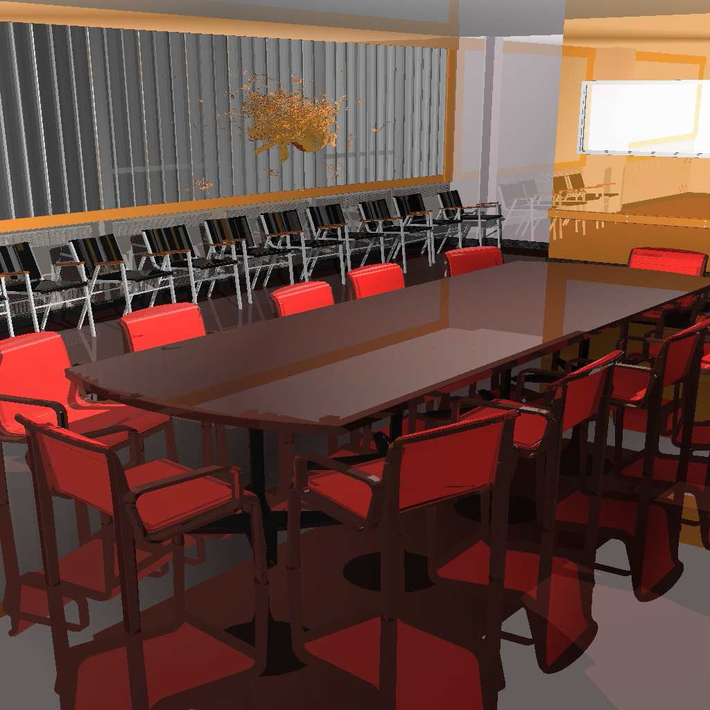

Raytracing using Uniform Grids on GPU. The code uses the CUDA interface to parallelize the raytracing activity. The title is a slight misnomer as we don't use uniform grids everywhere. We use perspective grids for primary and shadow rays and uniform grids for reflection rays.

---

---

The work got published in _[Eugraphics Symposium on Parallel Graphics and Visualization](http://diglib.eg.org/EG/DL/WS/EGPGV/EGPGV10/027-034.pdf.abstract.pdf;internal&action=action.digitallibrary.ShowPaperAbstract)_ and _[IEEE Transactions on Visualization and Computer Graphics](http://ieeexplore.ieee.org/xpl/login.jsp?tp=&arnumber=5728799&url=http%3A%2F%2Fieeexplore.ieee.org%2Fxpls%2Fabs_all.jsp%3Farnumber%3D5728799)_. Also check the [thesis](cvit.iiit.ac.in/thesis/sashidharMS2011/thesis02023.pdf) which this work was part of.
